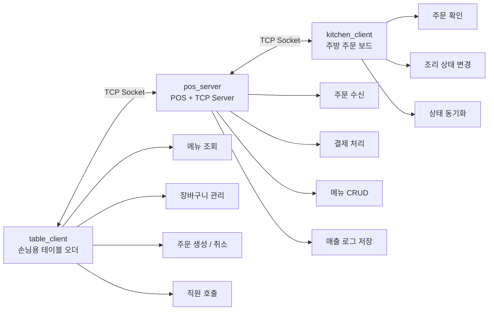
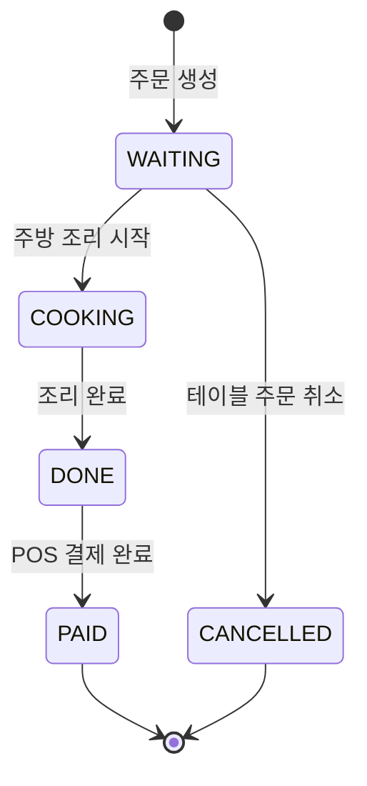
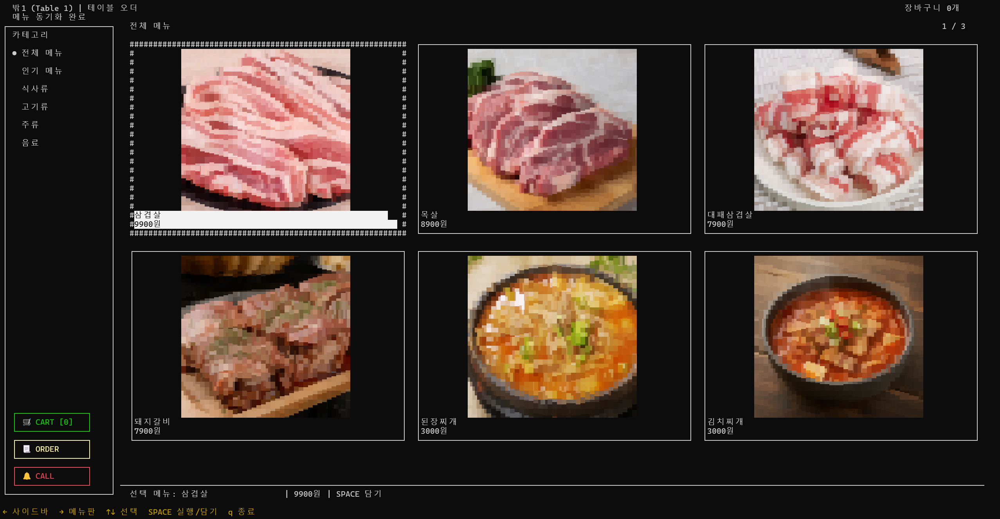
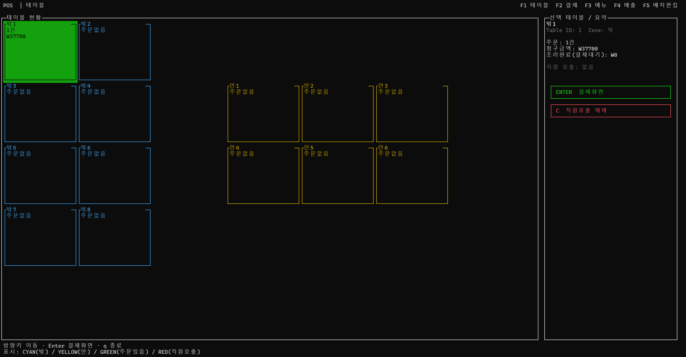
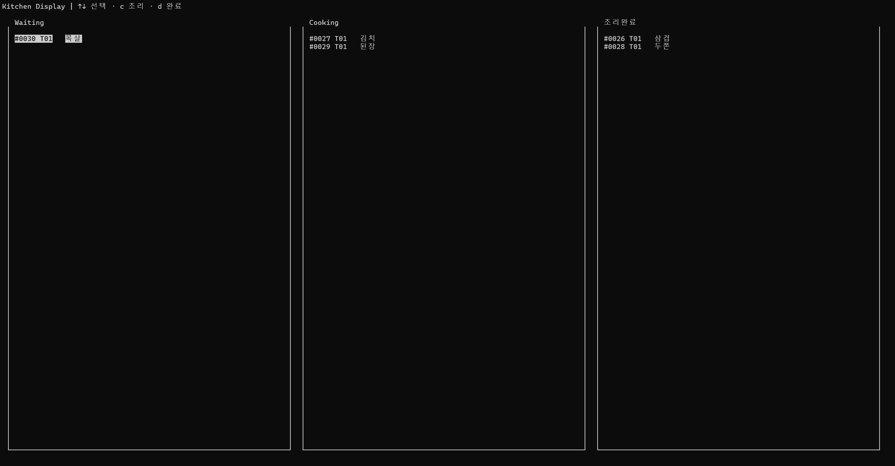
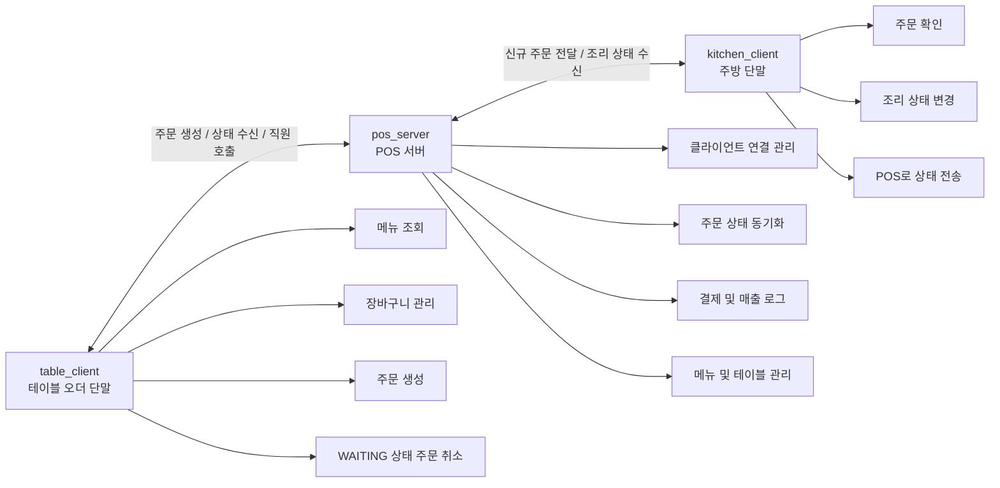

<div align="center">

# 🍽️ 다중 터미널 POS & 독립형 테이블 오더 시스템

### System Programming Team Project

<br/>


<br/>

**Table Order · POS Server · Kitchen Display**
소규모 매장을 위한 로컬 네트워크 기반 독립형 주문 통합 시스템

</div>

---

## 📌 Overview

본 프로젝트는 시스템프로그래밍 과목 팀 프로젝트로 개발한
**소규모 매장을 위한 독립형 테이블오더 통합 운영 시스템**입니다.

기존 테이블오더 시스템은 외부 서버, 상용 POS 연동, 월별 이용료, 위약금 등으로 인해
소규모 매장에서 도입하기 어려운 경우가 많습니다.

이를 해결하기 위해 본 프로젝트는 하나의 로컬 네트워크 환경에서
**테이블 주문 단말, POS 서버, 주방 단말**이 함께 동작하는 구조로 구현되었습니다.

손님은 테이블 단말에서 메뉴를 확인하고 주문할 수 있으며,
POS는 주문 접수와 결제, 메뉴 관리, 매출 기록을 담당합니다.
주방 단말은 주문을 실시간으로 확인하고 조리 상태를 변경할 수 있습니다.

---

## 🎥 Demo Preview

<p align="center">
  

</p>
  
<p align="center">
  <b>Table Order → POS Server → Kitchen Client</b><br/>
  테이블 주문 생성, 주방 상태 변경, POS 결제 처리까지의 전체 흐름
</p>
<p align="center">
  전체 데모 영상: <a href="docs/demo_full.mov">demo_full</a>
</p>

---

## 🧭 Table of Contents

* [Overview](#-overview)
* [Key Features](#-key-features)
* [System Architecture](#-system-architecture)
* [Component Overview](#-component-overview)
* [Tech Stack](#-tech-stack)
* [Project Structure](#-project-structure)
* [Build](#-build)
* [Run](#-run)
* [Test](#-test)
* [Demo Flow](#-demo-flow)
* [System Programming Points](#-system-programming-points)
* [Technical Challenges & Solutions](#-technical-challenges--solutions)
* [Team](#-team)
* [Summary](#-summary)
* [Limitations & Future Work](#-limitations--future-work)

---

## ✨ Key Features

| 구분                | 기능      | 설명                                      |
| ----------------- | ------- | --------------------------------------- |
| 🧾 Table Order    | 메뉴 조회   | 카테고리별 메뉴판 및 이미지 기반 메뉴 확인                |
| 🛒 Table Order    | 장바구니 관리 | 메뉴 추가, 수량 조절, 주문 전송                     |
| ❌ Table Order     | 주문 취소   | 주방 처리 전 `WAITING` 상태 주문 취소 가능           |
| 📞 Table Order    | 직원 호출   | 테이블에서 POS 및 주방으로 직원 호출 이벤트 전송           |
| 🖥️ POS Server    | 주문 관리   | 테이블에서 생성된 주문을 수신하고 전체 주문 상태 관리          |
| 💳 POS Server     | 결제 처리   | 완료된 주문을 결제 처리하고 매출 로그 저장                |
| 📝 POS Server     | 메뉴 관리   | 메뉴 추가, 수정, 삭제, 품절 상태 변경                 |
| 🍳 Kitchen Client | 주문 확인   | 접수된 주문을 주방 보드 형태로 확인                    |
| 🔄 Kitchen Client | 상태 변경   | `WAITING → COOKING → DONE` 순서로 조리 상태 변경 |
| 🛡️ System        | 안전 종료   | `SIGINT` 입력 시 소켓과 설정을 안전하게 정리           |

---

## 🏗️ System Architecture

본 시스템은 `table_client`, `pos_server`, `kitchen_client` 세 개의 실행 프로그램으로 구성됩니다.



### 주문 상태 흐름



---

## 🧩 Component Overview

본 시스템은 `table_client`, `pos_server`, `kitchen_client` 세 모듈이 TCP 소켓을 통해 실시간으로 연동되는 구조입니다.

| 🧾 table_client                                                              | ↔ | 🖥️ pos_server                                                                  | ↔ | 🍳 kitchen_client                                                         |
| ---------------------------------------------------------------------------- | - | ------------------------------------------------------------------------------- | - | ------------------------------------------------------------------------- |
| **손님용 테이블 오더 단말**                                                            |   | **중앙 POS 서버 및 관리 단말**                                                           |   | **주방용 주문 확인 단말**                                                          |
| 테이블에서 메뉴를 조회하고 장바구니에 담아 주문을 생성하는 클라이언트입니다. 주문 상태 확인, 직원 호출, 주문 취소 기능을 제공합니다. |   | 테이블과 주방 클라이언트의 연결을 관리하는 중심 서버입니다. 주문 수신, 상태 동기화, 메뉴 관리, 결제 처리, 매출 로그 저장을 담당합니다. |   | 주방에서 접수된 주문을 확인하고 조리 상태를 변경하는 클라이언트입니다. 변경된 상태는 POS와 테이블 화면에 실시간으로 반영됩니다. |

---

### 🧾 table_client
<p align="center">  </p>

| 기능        | 설명                                                            |
| --------- | ------------------------------------------------------------- |
| 메뉴 조회     | 카드형 메뉴판 화면을 구성하고, 카테고리별 메뉴를 조회할 수 있습니다.                       |
| 메뉴 이미지 출력 | `chafa`를 활용하여 터미널 환경에서도 메뉴 이미지를 확인할 수 있습니다.                   |
| 장바구니 관리   | 선택한 메뉴를 장바구니에 담고, 수량 변경 및 삭제를 수행할 수 있습니다.                     |
| 주문 생성     | 장바구니에 담긴 메뉴를 확정하여 POS 서버로 주문을 전송합니다.                          |
| 주문 상태 확인  | 주문 후 `WAITING`, `COOKING`, `DONE` 등의 상태를 테이블 화면에서 확인할 수 있습니다. |
| 직원 호출     | 테이블에서 직원 호출 이벤트를 발생시키고, POS 및 주방 화면에 알림을 표시합니다.               |
| 주문 취소     | 주방에서 조리를 시작하기 전인 `WAITING` 상태의 주문을 취소할 수 있습니다.                |

---

### 🖥️ pos_server
<p align="center">  </p>

| 기능          | 설명                                                |
| ----------- | ------------------------------------------------- |
| TCP 서버 역할   | 테이블 클라이언트와 주방 클라이언트의 접속을 수락하고 통신을 관리합니다.          |
| 다중 클라이언트 처리 | `pthread`를 사용하여 여러 테이블 및 주방 클라이언트 요청을 동시에 처리합니다.  |
| 주문 상태 동기화   | 주문 상태가 변경되면 POS, 테이블, 주방 화면에 동일한 상태가 반영되도록 관리합니다. |
| 수신 주문 관리    | 테이블에서 생성된 주문을 수신하고, 주문 목록 및 현재 상태를 관리합니다.         |
| 결제 처리       | 조리가 완료된 주문을 결제 처리하고, 결제 정보를 `sales.log`에 저장합니다.   |
| 메뉴 관리       | 메뉴 추가, 수정, 삭제 및 품절 상태 변경을 수행합니다.                  |
| 테이블 수 관리    | 설정 파일을 통해 매장 내 테이블 수를 관리합니다.                      |

---

### 🍳 kitchen_client
<p align="center">  </p>

| 기능        | 설명                                                |
| --------- | ------------------------------------------------- |
| 주문 확인     | 테이블에서 들어온 신규 주문을 실시간으로 수신하고 주방 화면에 표시합니다.         |
| 주문별 메뉴 확인 | 주문 번호와 함께 주문된 메뉴 및 수량을 확인할 수 있습니다.                |
| 조리 상태 변경  | 주문 상태를 `WAITING → COOKING → DONE` 순서로 변경할 수 있습니다. |
| 상태 전파     | 변경된 조리 상태를 POS 서버로 전송하여 POS와 테이블 화면에 실시간으로 반영합니다. |
| 직원 호출 알림  | 테이블에서 발생한 직원 호출 이벤트를 주방 화면에서도 확인할 수 있습니다.         |

---

### 🔄 Component Interaction Flow



---

## 🛠️ Tech Stack

| 구분               | 사용 기술         |
| ---------------- | ------------- |
| Language         | C             |
| Build            | Makefile      |
| UI               | ncursesw      |
| Network          | TCP Socket    |
| Thread           | pthread       |
| File I/O         | CSV, log file |
| Optional Preview | chafa         |
| Target OS        | Ubuntu 24.04  |

---

## 📁 Project Structure

```text
SystemProgrammingTeamProject/
├── Makefile
├── README.md
├── bin/
├── data/
│   ├── menu.csv
│   ├── tables.conf
│   ├── layout.conf
│   ├── orders.log
│   ├── sales.log
│   └── img_*.png
├── docs/
│   └── demo_scenario.md
├── include/
│   ├── common.h
│   ├── protocol.h
│   ├── menu.h
│   ├── order.h
│   ├── storage.h
│   ├── server.h
│   ├── ui.h
│   └── ui_common.h
├── src/
│   ├── pos_server.c
│   ├── table_client.c
│   ├── kitchen_client.c
│   ├── common.c
│   ├── protocol.c
│   ├── menu.c
│   ├── order.c
│   ├── storage.c
│   ├── layout.c
│   ├── server.c
│   ├── ui_common.c
│   ├── ui_pos.c
│   ├── ui_table.c
│   └── ui_kitchen.c
└── tests/
    ├── test_menu.c
    ├── test_order.c
    └── test_protocol.c
```

---

## ⚙️ Build

### 1. 패키지 설치

```bash
sudo apt update
sudo apt install -y build-essential pkg-config libncursesw6-dev
```

이미지 기반 메뉴 미리보기를 사용하려면 `chafa`를 추가로 설치합니다.

```bash
sudo apt install -y chafa
```

### 2. 프로젝트 빌드

프로젝트 루트 디렉터리에서 다음 명령어를 실행합니다.

```bash
make
```

빌드가 완료되면 `bin/` 디렉터리에 다음 실행 파일이 생성됩니다.

```text
bin/pos_server
bin/table_client
bin/kitchen_client
```

### 3. 빌드 결과 삭제

```bash
make clean
```

---

## 🚀 Run

본 프로젝트는 여러 개의 터미널에서 각각 POS 서버, 주방 클라이언트, 테이블 클라이언트를 실행하는 방식으로 동작합니다.

### 1. POS 서버 실행

터미널 1에서 실행합니다.

```bash
./bin/pos_server 9090
```

또는 Makefile helper를 사용할 수 있습니다.

```bash
make run-server PORT=9090
```

---

### 2. 주방 클라이언트 실행

터미널 2에서 실행합니다.

```bash
./bin/kitchen_client 127.0.0.1 9090
```

또는 Makefile helper를 사용할 수 있습니다.

```bash
make run-kitchen HOST=127.0.0.1 PORT=9090
```

---

### 3. 테이블 클라이언트 실행

터미널 3에서 실행합니다.

```bash
./bin/table_client 127.0.0.1 9090 1
```

마지막 인자는 테이블 번호입니다.

예를 들어 2번 테이블을 실행하려면 다음과 같이 입력합니다.

```bash
./bin/table_client 127.0.0.1 9090 2
```

또는 Makefile helper를 사용할 수 있습니다.

```bash
make run-table HOST=127.0.0.1 PORT=9090 TABLE=1
```

---

## 🧪 Test

다음 명령어로 테스트 코드를 실행할 수 있습니다.

```bash
make test
```

테스트 항목은 다음과 같습니다.

| 테스트 파일            | 검증 내용                |
| ----------------- | -------------------- |
| `test_menu.c`     | 메뉴 데이터 로드 및 처리       |
| `test_order.c`    | 주문 및 장바구니 자료구조       |
| `test_protocol.c` | 클라이언트-서버 문자열 프로토콜 파싱 |

---

### 🎬 시연 체크리스트

* [ ] POS 서버 실행
* [ ] 주방 클라이언트 연결
* [ ] 테이블 클라이언트 연결
* [ ] 테이블에서 메뉴 조회
* [ ] 장바구니에 메뉴 추가
* [ ] 주문 전송
* [ ] POS에서 주문 수신 확인
* [ ] 주방에서 주문 확인
* [ ] 주방에서 `COOKING` 상태 변경
* [ ] 주방에서 `DONE` 상태 변경
* [ ] 테이블 화면에 상태 동기화 확인
* [ ] POS에서 결제 처리
* [ ] `data/sales.log` 매출 기록 확인
* [ ] 메뉴 품절 처리
* [ ] `Ctrl+C` 안전 종료 확인

---

## 🧩 System Programming Points


| 구분                 | 사용 요소                                           | 적용 목적                         |
| ------------------ | ----------------------------------------------- | ----------------------------- |
| Socket Programming | `socket`, `bind`, `listen`, `accept`, `connect` | POS 서버와 테이블/주방 클라이언트 간 TCP 통신 |
| Multi-threading    | `pthread_create`, `pthread_mutex_lock`          | 다중 클라이언트 동시 접속 처리 및 주문 데이터 보호 |
| File I/O           | `open`, `read`, `write`, `fsync`, `rename`      | 메뉴, 설정, 주문 로그, 매출 로그 저장       |
| Signal Handling    | `sigaction`                                     | `Ctrl+C` 입력 시 안전한 종료 처리       |
| Process Control    | `fork`, `waitpid`                               | 선택적 이미지 렌더링 프로세스 처리           |
| Terminal UI        | `ncursesw`                                      | POS, 테이블, 주방 화면 구성            |
| Event Handling     | non-blocking receive loop                       | 주문, 호출, 상태 변경 이벤트 실시간 반영      |

---

## 👥 Team

| 이름  |         학번 | 담당 역할             |
| --- | ---------: | ----------------- |
| 장시온 | 2022110617 | Kitchen 기능 구현     |
| 이상윤 | 2022113736 | POS 및 서버 전체 기능 구현 |
| 이정원 | 2022116284 | Table 기능 구현       |

### 역할 상세

| 팀원  | 구현 내용                                                                                                                      |
| --- | -------------------------------------------------------------------------------------------------------------------------- |
| 장시온 | `ui_kitchen.c` 기반 3-column Kanban 보드 구현, `c/d` 키 기반 주문 상태 전이, `ORDER_EVENT` 실시간 수신 및 보드 동기화, `STAFF_CALL` 알림 표시            |
| 이상윤 | `pos_server.c`, `server.c` 기반 TCP 서버와 POS 통합 구조 구현, `ui_pos.c` 기반 POS 화면 및 기능 구현, 주문/결제/메뉴 관리, 데이터 저장 구조 구현, 최종 병합 및 충돌 해결 |
| 이정원 | `ui_table.c` 기반 테이블 오더 화면 구현, 카드형 메뉴판/카테고리/장바구니/직원 호출 UI, 메뉴 이미지 출력 및 화면 전환 렌더링 문제 해결, 주문 생성·취소 및 상태 표시 로직 구현              |

---

## 📊 Summary

| 항목        | 내용                                  |
| --------- | ----------------------------------- |
| 프로젝트명     | 다중 터미널 POS & 독립형 테이블 오더 시스템         |
| 핵심 구조     | Table - POS - Kitchen 3자 실시간 연동     |
| 핵심 기능 수   | 6개                                  |
| 주요 시스템콜 수 | 19개                                 |
| 코드 규모     | 약 5,600 LOC                         |
| 개발 환경     | Ubuntu 24.04, C, Makefile, ncursesw |

---


<div align="center">

### ✅ Build once, run three terminals, manage the whole store.

**Table Order · POS · Kitchen Display**

</div>
