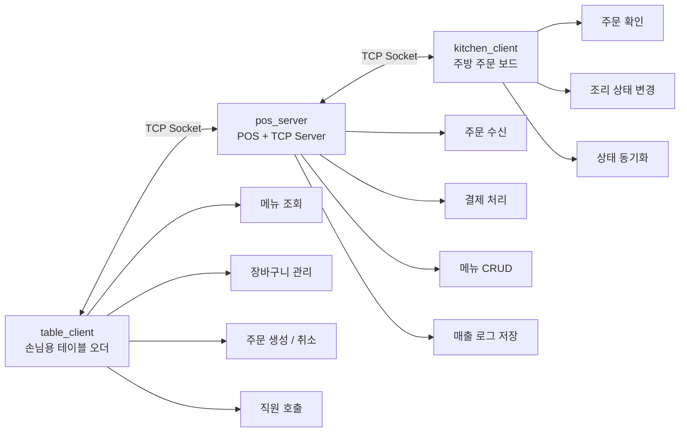
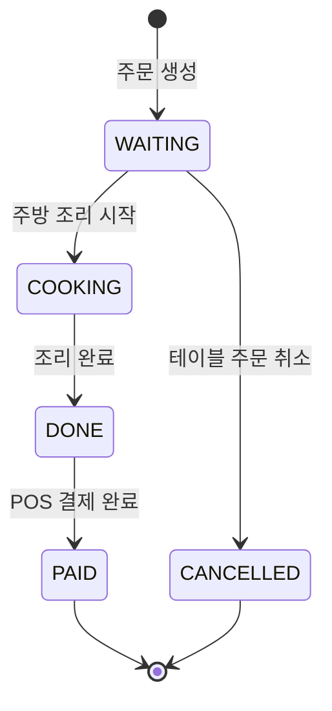
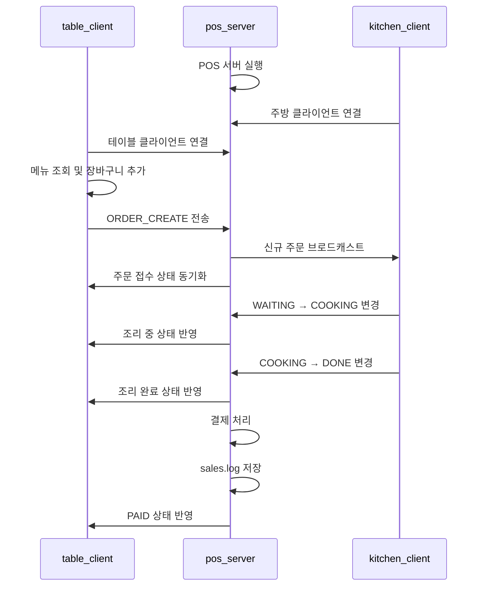

<div align="center">

# 🍽️ 다중 터미널 POS & 독립형 테이블 오더 시스템

### System Programming Team Project

<br/>


\

<br/>

**Table Order · POS Server · Kitchen Display**
소규모 매장을 위한 로컬 네트워크 기반 독립형 주문 통합 시스템

</div>

---

## 📌 Overview

본 프로젝트는 시스템프로그래밍 과목 팀 프로젝트로 개발한
**소규모 매장을 위한 독립형 테이블오더 통합 운영 시스템**입니다.

기존 테이블오더 시스템은 외부 서버, 상용 POS 연동, 월별 이용료, 위약금 등으로 인해
소규모 매장에서 도입하기 어려운 경우가 많습니다.

이를 해결하기 위해 본 프로젝트는 하나의 로컬 네트워크 환경에서
**테이블 주문 단말, POS 서버, 주방 단말**이 함께 동작하는 구조로 구현되었습니다.

손님은 테이블 단말에서 메뉴를 확인하고 주문할 수 있으며,
POS는 주문 접수와 결제, 메뉴 관리, 매출 기록을 담당합니다.
주방 단말은 주문을 실시간으로 확인하고 조리 상태를 변경할 수 있습니다.

---

## 🧭 Table of Contents

* [Overview](#-overview)
* [Key Features](#-key-features)
* [System Architecture](#-system-architecture)
* [Tech Stack](#-tech-stack)
* [Project Structure](#-project-structure)
* [Build](#-build)
* [Run](#-run)
* [Test](#-test)
* [Demo Flow](#-demo-flow)
* [System Programming Points](#-system-programming-points)
* [Team](#-team)
* [Limitations & Future Work](#-limitations--future-work)

---

## ✨ Key Features

| 구분                | 기능      | 설명                                      |
| ----------------- | ------- | --------------------------------------- |
| 🧾 Table Order    | 메뉴 조회   | 카테고리별 메뉴판 및 이미지 기반 메뉴 확인                |
| 🛒 Table Order    | 장바구니 관리 | 메뉴 추가, 수량 조절, 주문 전송                     |
| ❌ Table Order     | 주문 취소   | 주방 처리 전 `WAITING` 상태 주문 취소 가능           |
| 📞 Table Order    | 직원 호출   | 테이블에서 POS 및 주방으로 직원 호출 이벤트 전송           |
| 🖥️ POS Server    | 주문 관리   | 테이블에서 생성된 주문을 수신하고 전체 주문 상태 관리          |
| 💳 POS Server     | 결제 처리   | 완료된 주문을 결제 처리하고 매출 로그 저장                |
| 📝 POS Server     | 메뉴 관리   | 메뉴 추가, 수정, 삭제, 품절 상태 변경                 |
| 🍳 Kitchen Client | 주문 확인   | 접수된 주문을 주방 보드 형태로 확인                    |
| 🔄 Kitchen Client | 상태 변경   | `WAITING → COOKING → DONE` 순서로 조리 상태 변경 |
| 🛡️ System        | 안전 종료   | `SIGINT` 입력 시 소켓과 설정을 안전하게 정리           |

---

## 🏗️ System Architecture

본 시스템은 세 개의 실행 프로그램으로 구성됩니다.



### 주문 상태 흐름



---

## 🛠️ Tech Stack

| 구분               | 사용 기술         |
| ---------------- | ------------- |
| Language         | C             |
| Build            | Makefile      |
| UI               | ncursesw      |
| Network          | TCP Socket    |
| Thread           | pthread       |
| File I/O         | CSV, log file |
| Optional Preview | chafa         |
| Target OS        | Ubuntu 24.04  |

---

## 📁 Project Structure

```text
SystemProgrammingTeamProject/
├── Makefile
├── README.md
├── bin/
├── data/
│   ├── menu.csv
│   ├── tables.conf
│   ├── layout.conf
│   ├── orders.log
│   ├── sales.log
│   └── img_*.png
├── docs/
│   └── demo_scenario.md
├── include/
│   ├── common.h
│   ├── protocol.h
│   ├── menu.h
│   ├── order.h
│   ├── storage.h
│   ├── server.h
│   ├── ui.h
│   └── ui_common.h
├── src/
│   ├── pos_server.c
│   ├── table_client.c
│   ├── kitchen_client.c
│   ├── common.c
│   ├── protocol.c
│   ├── menu.c
│   ├── order.c
│   ├── storage.c
│   ├── layout.c
│   ├── server.c
│   ├── ui_common.c
│   ├── ui_pos.c
│   ├── ui_table.c
│   └── ui_kitchen.c
└── tests/
    ├── test_menu.c
    ├── test_order.c
    └── test_protocol.c
```

---

## ⚙️ Build

### 1. 패키지 설치

```bash
sudo apt update
sudo apt install -y build-essential pkg-config libncursesw6-dev
```

이미지 기반 메뉴 미리보기를 사용하려면 `chafa`를 추가로 설치합니다.

```bash
sudo apt install -y chafa
```

### 2. 프로젝트 빌드

프로젝트 루트 디렉터리에서 다음 명령어를 실행합니다.

```bash
make
```

빌드가 완료되면 `bin/` 디렉터리에 다음 실행 파일이 생성됩니다.

```text
bin/pos_server
bin/table_client
bin/kitchen_client
```

### 3. 빌드 결과 삭제

```bash
make clean
```

---

## 🚀 Run

본 프로젝트는 여러 개의 터미널에서 각각 POS 서버, 주방 클라이언트, 테이블 클라이언트를 실행하는 방식으로 동작합니다.

### 1. POS 서버 실행

터미널 1에서 실행합니다.

```bash
./bin/pos_server 9090
```

또는 Makefile helper를 사용할 수 있습니다.

```bash
make run-server PORT=9090
```

---

### 2. 주방 클라이언트 실행

터미널 2에서 실행합니다.

```bash
./bin/kitchen_client 127.0.0.1 9090
```

또는 Makefile helper를 사용할 수 있습니다.

```bash
make run-kitchen HOST=127.0.0.1 PORT=9090
```

---

### 3. 테이블 클라이언트 실행

터미널 3에서 실행합니다.

```bash
./bin/table_client 127.0.0.1 9090 1
```

마지막 인자는 테이블 번호입니다.

예를 들어 2번 테이블을 실행하려면 다음과 같이 입력합니다.

```bash
./bin/table_client 127.0.0.1 9090 2
```

또는 Makefile helper를 사용할 수 있습니다.

```bash
make run-table HOST=127.0.0.1 PORT=9090 TABLE=1
```

---

## 🧪 Test

다음 명령어로 테스트 코드를 실행할 수 있습니다.

```bash
make test
```

테스트 항목은 다음과 같습니다.

| 테스트 파일            | 검증 내용                |
| ----------------- | -------------------- |
| `test_menu.c`     | 메뉴 데이터 로드 및 처리       |
| `test_order.c`    | 주문 및 장바구니 자료구조       |
| `test_protocol.c` | 클라이언트-서버 문자열 프로토콜 파싱 |

---

## 🎬 Demo Flow

아래 순서로 프로젝트의 핵심 기능을 시연할 수 있습니다.



### 시연 체크리스트

* [ ] POS 서버 실행
* [ ] 주방 클라이언트 연결
* [ ] 테이블 클라이언트 연결
* [ ] 테이블에서 메뉴 조회
* [ ] 장바구니에 메뉴 추가
* [ ] 주문 전송
* [ ] POS에서 주문 수신 확인
* [ ] 주방에서 주문 확인
* [ ] 주방에서 `COOKING` 상태 변경
* [ ] 주방에서 `DONE` 상태 변경
* [ ] 테이블 화면에 상태 동기화 확인
* [ ] POS에서 결제 처리
* [ ] `data/sales.log` 매출 기록 확인
* [ ] 메뉴 품절 처리
* [ ] `Ctrl+C` 안전 종료 확인

---

## 🧩 System Programming Points


| 구분                 | 사용 요소                                           | 적용 목적                         |
| ------------------ | ----------------------------------------------- | ----------------------------- |
| Socket Programming | `socket`, `bind`, `listen`, `accept`, `connect` | POS 서버와 테이블/주방 클라이언트 간 TCP 통신 |
| Multi-threading    | `pthread_create`, `pthread_mutex_lock`          | 다중 클라이언트 동시 접속 처리 및 주문 데이터 보호 |
| File I/O           | `open`, `read`, `write`, `fsync`, `rename`      | 메뉴, 설정, 주문 로그, 매출 로그 저장       |
| Signal Handling    | `sigaction`                                     | `Ctrl+C` 입력 시 안전한 종료 처리       |
| Process Control    | `fork`, `waitpid`                               | 선택적 이미지 렌더링 프로세스 처리           |
| Terminal UI        | `ncursesw`                                      | POS, 테이블, 주방 화면 구성            |
| Event Handling     | non-blocking receive loop                       | 주문, 호출, 상태 변경 이벤트 실시간 반영      |

---

## 🧱 Technical Challenges & Solutions

| 문제 상황                                 | 해결 방법                                                       |
| ------------------------------------- | ----------------------------------------------------------- |
| 여러 테이블이 동시에 접속할 때 서버 블로킹 발생           | `accept()`로 연결 수락 후 `pthread_create()`를 통해 클라이언트별 처리 스레드 생성 |
| 주문 취소와 주방 상태 변경이 동시에 발생할 때 데이터 불일치 가능 | `pthread_mutex_lock()`으로 주문 데이터 접근 직렬화                      |
| 이미지 기반 메뉴판 렌더링 후 화면 잔상이 남는 문제         | 이미지 출력 로직을 분리하고 화면 전환 시 출력 영역 초기화                           |
| 설정 파일 변경 중 프로그램이 종료될 경우 데이터 손상 가능     | 임시 파일 저장 후 `fsync()`와 `rename()`을 사용해 원자적 저장 처리             |
| 서버 종료 시 클라이언트 소켓 정리 문제                | `SIGINT` 핸들러에서 `shutdown()` 및 `close()` 처리                  |

---

## 👥 Team

| 이름  | 학번         | 담당 역할             |
| --- | ---------- | ----------------- |
| 장시온 | 2022110617 | Kitchen 기능 구현     |
| 이상윤 | 2022113736 | POS 및 서버 전체 기능 구현 |
| 이정원 | 2022116284 | Table 기능 구현       |

### 역할 상세

| 팀원  | 구현 내용                                                                                                                      |
| --- | -------------------------------------------------------------------------------------------------------------------------- |
| 장시온 | `ui_kitchen.c` 기반 3-column Kanban 보드 구현, `c/d` 키 기반 주문 상태 전이, `ORDER_EVENT` 실시간 수신 및 보드 동기화, `STAFF_CALL` 알림 표시            |
| 이상윤 | `pos_server.c`, `server.c` 기반 TCP 서버와 POS 통합 구조 구현, `ui_pos.c` 기반 POS 화면 및 기능 구현, 주문/결제/메뉴 관리, 데이터 저장 구조 구현, 최종 병합 및 충돌 해결 |
| 이정원 | `ui_table.c` 기반 테이블 오더 화면 구현, 카드형 메뉴판/카테고리/장바구니/직원 호출 UI, 메뉴 이미지 출력 및 화면 전환 렌더링 문제 해결, 주문 생성·취소 및 상태 표시 로직 구현              |

---

## 📊 Summary

| 항목        | 내용                                  |
| --------- | ----------------------------------- |
| 프로젝트명     | 다중 터미널 POS & 독립형 테이블 오더 시스템         |
| 핵심 구조     | Table - POS - Kitchen 3자 실시간 연동     |
| 핵심 기능 수   | 6개                                  |
| 주요 시스템콜 수 | 19개                                 |
| 코드 규모     | 약 5,600 LOC                         |
| 개발 환경     | Ubuntu 24.04, C, Makefile, ncursesw |

---

## 🔮 Limitations & Future Work

현재 프로젝트는 시스템프로그래밍 수업의 요구사항에 맞추어 로컬 네트워크 기반으로 구현되었습니다.
향후 실제 매장 환경에 적용하기 위해서는 다음과 같은 개선이 필요합니다.

* 사용자 인증 및 관리자 권한 분리
* 주문 데이터베이스 연동
* 서버 비정상 종료 시 미결 주문 복구
* 결제 API 연동
* 웹 또는 모바일 기반 테이블오더 UI 확장
* 더 다양한 예외 상황 처리
* 이미지 품질 및 터미널 조작성 개선

---

<div align="center">

### ✅ Build once, run three terminals, manage the whole store.

**Table Order · POS · Kitchen Display**

</div>


다중 터미널 POS 및 독립형 테이블 오더 시스템
팀 정보
팀명: team 18
| 이름 | 학번 | 역할 분담 | | 이상윤 | 2022113736 | POS 및 전반적인 기능 구현 | | 이정원 | 2022116284 | Table 기능 구현 | | 장시온 | 2022110617 | Kitchen 기능 구현 |

프로젝트 개요
Ubuntu 24.04 로컬 네트워크 환경에서 외부 클라우드 없이 동작하는 테이블 오더·주방 디스플레이·POS 통합 시스템입니다. pos_server 단일 바이너리가 TCP 서버와 POS ncurses UI를 동시에 수행하고, table_client·kitchen_client가 각각 손님 단말과 주방 단말 역할을 합니다. 주문 상태는 WAITING → COOKING → DONE → PAID로 진행되며, 결제 전 단계에서는 CANCELLED로 취소할 수 있습니다. 모든 통신은 줄바꿈(\n)으로 구분되는 문자열 프로토콜로 이루어지고, 메뉴·설정·매출 데이터는 파일 로그로 지속화합니다.

빠른 시작 (Quick Start)
# 1) 의존성 설치 후 빌드
sudo apt update && sudo apt install -y build-essential libncurses-dev
cd SystemProgrammingTeamProject
make

# 2) 4개 터미널에서 실행 (UTF-8 로케일 권장)
./bin/pos_server 9090                     # 터미널 1: POS 서버
./bin/kitchen_client 127.0.0.1 9090       # 터미널 2: 주방 단말
./bin/table_client 127.0.0.1 9090 1       # 터미널 3: 1번 테이블
./bin/table_client 127.0.0.1 9090 2       # 터미널 4: 2번 테이블 (선택)
터미널 인코딩이 UTF-8인지 확인하세요. 한글이 깨지면 export LANG=ko_KR.UTF-8(또는 C.UTF-8)로 설정합니다. ncurses UI가 잘리지 않도록 터미널 창은 최소 100×30 이상을 권장합니다.

주요 기능
메뉴 CSV 관리 및 테이블 장바구니 주문: data/menu.csv를 로드하고 품절 플래그를 검사한 뒤 ORDER_CREATE를 송신합니다.
다중 클라이언트 소켓 서버: pthread 기반 수락/세션 처리와 주문 이벤트 브로드캐스트(ORDER_EVENT)로 실시간 동기화를 제공합니다.
관리자 기능: POS 화면에서 메뉴 CRUD·품절 토글·테이블 수 조정 후 설정 파일에 즉시 반영합니다.
주방 상태 관리 & 직원 호출: 주방 단말에서 상태 전이를 올리고, 테이블 단말은 CALL_STAFF로 POS/주방에 알림을 띄웁니다.
주문 취소: 결제 전(WAITING/COOKING) 주문은 ORDER_CANCEL로 취소하여 CANCELLED 상태로 전파합니다.
결제 및 매출 로그: DONE 주문만 PAYMENT_REQUEST로 결제 처리하여 data/sales.log에 매출 라인을 남기고 상태를 PAID로 전파합니다.
SIGINT 안전 종료 & 선택적 chafa 미리보기: Ctrl+C 시 소켓과 설정을 정리하고, data/img_<메뉴ID>.png와 chafa 설치 시 메뉴 이미지 미리보기를 제공합니다.
통신 프로토콜
모든 메시지는 한 줄 단위이며 줄바꿈(\n)으로 종료됩니다. 필드 구분자는 파이프(|), 항목 구분자는 ;와 ,를 사용합니다.

클라이언트 → 서버
메시지	형식 예시	설명
테이블 접속	HELLO TABLE 1	테이블 단말이 테이블 번호와 함께 접속
주문 생성	ORDER_CREATE|table=1|items=10:2,11:1	items는 메뉴ID:수량 쌍을 ,로 나열
상태 변경	ORDER_UPDATE|order_id=5|status=COOKING	주방 단말이 주문 상태 전이
주문 취소	ORDER_CANCEL|order_id=5	결제 전 주문 취소
결제 요청	PAYMENT_REQUEST|order_id=5	DONE 주문 결제
직원 호출	CALL_STAFF|table=1	테이블 단말에서 호출
서버 → 클라이언트 (브로드캐스트)
메시지	형식 예시	설명
메뉴 응답	MENU_RESPONSE|10,아메리카노,3000,0,커피,1;11,...	id,이름,가격,품절,분류,인기 항목을 ;로 나열
주문 이벤트	ORDER_EVENT|order_id=5|table=1|status=DONE|total=9000|created=<epoch>|items=10:2:아메리카노:3000;...	주문 생성·상태 변경 시 전체 단말에 전파
직원 호출 알림	STAFF_CALL|table=1	POS/주방에 호출 표시
이름 필드에 포함된 , ; \| : 개행은 서버에서 _로 치환(sanitize)하여 프레이밍 깨짐을 방지합니다.

사용한 시스템콜 및 목적
계층	대표 syscall/API	사용 목적
네트워크	socket, bind, listen, accept, connect, shutdown, setsockopt	IPv4 TCP 서버/클라이언트 채널 구축 및 종료
I/O	read, write, open, close, fsync	소켓 프레이밍·메뉴 CSV·설정·로그 파일 입출력
파일 메타	stat, fstat, lseek, rename	파일 존재/크기 확인, 매출 tail 조회, 임시파일 후 rename 원자적 저장
프로세스/동기화	fork, waitpid, execlp, popen, pthread_*, sigaction	chafa 이미지 렌더링 자식 프로세스, 서버 스레드/뮤텍스, SIGINT 처리
빌드 방법
sudo apt update
sudo apt install -y build-essential libncurses-dev
cd SystemProgrammingTeamProject
make
한글 UI는 UTF-8 로케일 + -lncursesw(wide) 조합으로 렌더링합니다(ui_pos.c·ui_table.c·ui_kitchen.c에서 <ncursesw/ncurses.h> 사용, 클라이언트에서 setlocale 호출). 터미널 인코딩이 UTF-8인지 확인하세요.

libncurses-dev가 wide-character(ncursesw) 헤더와 라이브러리를 함께 제공합니다. (구버전 문서의 libncursesw5-dev는 libncurses-dev로 통합된 전환 패키지이며, libncursesw6-dev라는 패키지는 존재하지 않습니다.)

추가로 이미지 미리보기를 시험하려면 sudo apt install -y chafa 후 data/img_<메뉴ID>.png 파일을 배치합니다. chafa가 없어도 나머지 기능은 정상 동작합니다.

실행 방법
# 터미널 1
./bin/pos_server 9090

# 터미널 2
./bin/kitchen_client 127.0.0.1 9090

# 터미널 3
./bin/table_client 127.0.0.1 9090 1

# 터미널 4 (선택)
./bin/table_client 127.0.0.1 9090 2
Makefile 헬퍼:

make run-server PORT=9090
make run-kitchen HOST=127.0.0.1 PORT=9090
make run-table HOST=127.0.0.1 PORT=9090 TABLE=2
